## [Introduction](#table-of-content)

This is the second Milestone Project with Code Institute.

This Project will just have HTML, CSS, and vanilla JavaScript.

- This is a simple attempt of the popular Hangman game.
- Were players guessing a letter and the word is uncovered as you go along?
- When players enter the incorrect letter, a piece of the hangman is drawn, keeping an attempt to have as little as 10 
tries
- Players are able to win this game by scoring 20 points, but only if the entire word is correct

### User Story

- As a player
- I want to play a game of Hangman
- This is an attempt to test my vocabulary and word skills while having fun with it

Acceptance criteria

1. When I open the game for the first time, I should be presented with a screen to begin playing the game
2. Upon starting the game, I am presented with blank spaces, where the letters would go
3. I have exactly 10 chances to guess the correct word
4. either using the keyboard on the onscreen qwerty keyboard
5. For every incorrect answer a piece of the hangman is drawn
6. You win the game by getting your score to 20 points, but only once the word has been filled in

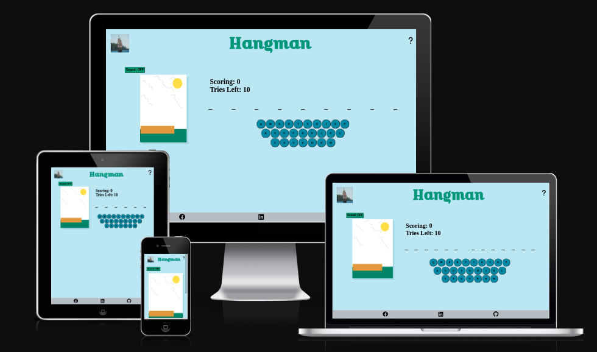

[Live site](https://douglas86.github.io/hangman/)
---

# Table of Content

- [Introduction](#introduction)
- [How do i run this project](#how-do-i-run-this-project)
- [Features](#features)
  - [Heading](#heading)
  - [Toggle to turn sound on and off](#toggle-to-turn-sound-on-and-off)
  - [Hangman image](#hangman-image)
  - [Score and Tries](#scores-and-tries)
  - [Word that needs to be guessed](#word-that-needs-to-be-guessed)
  - [onscreen qwerty keyboard](#onscreen-qwerty-keyboard)
  - [footer](#footer)
- [Planning](#planning)
  - [Colour Pallet](#colour-pallet)
  - [Technology Used](#technology-used)
    - [GitHub: Pros and Cons](#github-pros-and-cons)
    - [Jetbrains Spaces: Pros and Cons](#jetbrains-spaces-pros-and-cons)
  - [Testing](#testing)
  - [Wire framing](#wire-framing)
    - [Mobile Devices](#mobile-device)
    - [Tablet Devices](#tablet-device)
    - [Desktop Devices](#desktop-devices)
- [Bugs and Planning](#bugs-and-problems)
  - [Array appending instead of replacing](#array-appending-instead-of-replacing)
  - [Hangman Images not Changing on tries variable change](#hangman-images-not-changing-on-tries-variable-change)
  - [Image not displayed on negative tries variable](#image-not-displayed-on-negative-tries-variable)
- [Credits](#credits)

---

## [How do I run this project?](#table-of-content)

### Locally

- You can install this project using the following commands one or the other
- git clone git@github.com:douglas86/hangman.git - if using ssh
- git clone https://github.com/douglas86/hangman.git - if using https

### Going live on GitHub Pages

- To get this up and running on GitHub pages
- go to the setting tab of your repository
- on the left there go to the one that says pages
- under the branch section, select what branch you want to live
- I selected the main branch
- go to the actions tab and watch it being built and deployed

---

## [Features](#table-of-content)

### [Heading](#table-of-content)

- Small image on the Left-Hand side—displaying a ship in the ocean
- Title of the game in the center
- Question mark for How to Play once clicked on

### [Toggle to turn sound on and off](#table-of-content)

- Button toggle to turn sound on and off
- When toggle is switched on, sound will play on correct or incorrect answers

### [Hangman image](#table-of-content)

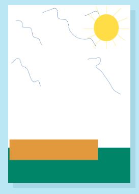

- images change based on tries left
- When tries hits 0, the full hangman image is drawn

### [Scores and Tries](#table-of-content)

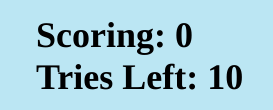

- The score changes based-on-letter pressed
- When the letter is correct score add 2
- When the letter is incorrect, the score subtracts by 1
- For every correct answer, the score subtracts 1 with the try variable

### [Word that needs to be guessed](#table-of-content)

- The word to be guessed
- The word is randomly selected from an array with objects
- The object is there to allow for future expansion

### [onscreen qwerty keyboard](#table-of-content)

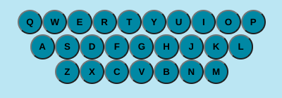

- Qwerty keyboard layout
- They are all button clicks, for if a mechanical keyboard is not present
- Letters of the keyboard changes once clicked on

### [Footer](#footer)

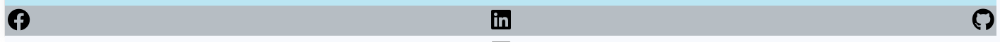

- All icons are clickable links taking you to my home page of the different applications

### [Main Content](#table-of-content)

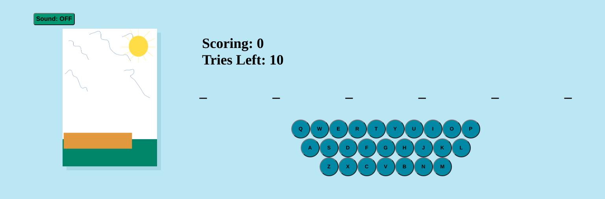

- Main display of all my content
- Qwerty keyboard, spacing for the letters go and the image with toggle sound button above

### [Features that I want to add at a later stage](#table-of-content)

- I am wanting to add a category section
- I have only added 10 items of data with the category of countries
- This is here to allow for future expansion

---

## [Planning](#table-of-content)

### [Colour Pallet](#table-of-content)

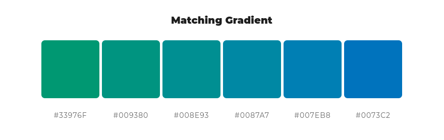

[URL: color space](https://mycolor.space/?hex=%2333976F&sub=1)

### [Technology Used](#table-of-content)

- figma—designing the wire frame diagram
- GitHub and Jetbrains Spaces—version control system
- Intellij - my coding editor
- Slack—used for communication with mentor
- Google Chrome - web browser
- GitHub pages for going live

Comparison of using GitHub and Jetbrains Spaces.

The reason that I decided to use the two version control systems was I wanted to explore more of their products, as
their products are good and I enjoy using them.

#### [GitHub Pros and Cons](#table-of-content)

| Pros                                      | Cons                               |
|-------------------------------------------|------------------------------------|
| Most popular version control system       | very basic features                |
| Easy to create a new repository           | difficult to organise repositories |
| Can create private or public repositories |                                    |

#### [Jetbrains Spaces Pros and Cons](#table-of-content)

| Pros                                                   | Cons                                          |
|--------------------------------------------------------|-----------------------------------------------|
| Lots of nice features                                  | Only has limited features on the free version |
| Easy to setup and mirror other version control systems | Can be expensive                              |
| Excellent tool for using in collaboration              | Can't mix different paid plans                |
| Integrates well with Jetbrains products                | Can only create private repositories          |
| Easy to organise repositories into projects            |                                               |

### [Testing](#table-of-content)

| What is being tested?                                                                         | Result |
|-----------------------------------------------------------------------------------------------|--------|
| Music is not playing when button are clicked                                                  | PASS   |
| Music plays when sound button is toggled                                                      | PASS   |
| When qwerty keyboard button is clicked letter displays, saying the character that was pressed | PASS   |
| When keyboard letter is pressed the letter is displayed                                       | PASS   |
| You can only press the keyboard character once                                                | PASS   |
| You can only click a specific button on qwerty keyboard once                                  | PASS   |
| If you click a letter on keyboard then switch to qwerty keyboard, that letter registers again | FAIL   |
| scoring adds by 2 for every correct character                                                 | PASS   |
| scoring subtracts by 1 for every incorrect character                                          | PASS   |
| tries subtracts by 1 for every incorrect character                                            | PASS   |
| once tries hits 0 the hangman image is showing the full picture                               | PASS   |
| hangman image changes on tries change                                                         | PASS   |
| if tries hits 0 the overlay will display saying game loss                                     | PASS   |
| if score greater than or equal to 100 overlay will display saying congratulations             | PASS   |
| clicking "?" mark next to header will say show how to play the game                           | PASS   |
| as soon as the correct array is filled in, it shows a new word to be guessed                  | PASS   |
| all external links open in a new tab                                                          | PASS   |
| keyboard buttons change when clicked or keydown event is triggered                            | PASS   |
| website layout is responsive                                                                  | PASS   ||                                                                                               |

HTML validator

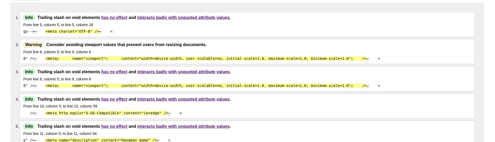

- There were only info and warning errors
- 5 warnings
- 10 info

CSS validator

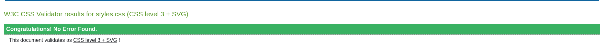

Lighthouse score on mobile

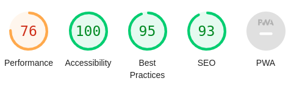

Lighthouse score on Desktop

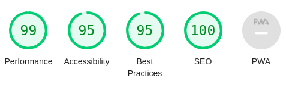

### [Wire framing](#table-of-content)

#### [Mobile Device](#table-of-content)

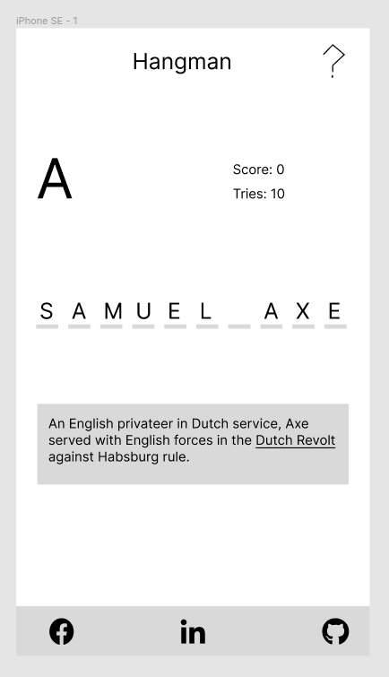

#### [Tablet Device](#table-of-content)

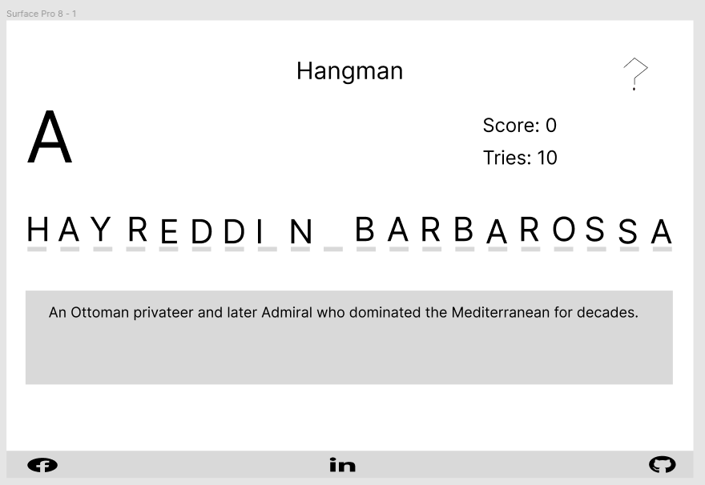

#### [Desktop Devices](#table-of-content)

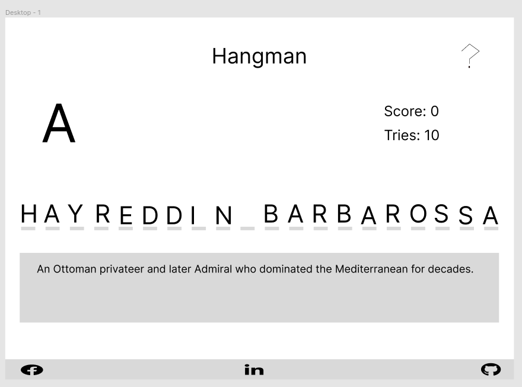

#### JavaScript Testing

All JS files were tested on [jshint](https://jshint.com/)

You can find all individual testings [here](test.md)

There was only warning in jshint testing

---

## [Bugs and Problems](#table-of-content)

### [Array appending instead of replacing](#table-of-content)

- What is it suppose to do?
  
When I press a correct key, it should display the new array with the updated key

- What is it doing?

As the correct key is pressed instead of displaying the new created array, it is appended to the previous array, 
which then creates a longer array with to many spaces or letters.

- How did I get it to work?

When the correct key is pressed, 
that key is then placed in the array replacing the spaces that were created on a page 
load, while doing that I also replace the previous array passed into the function 
with the newly created array.

This is how it looks on a page load, with random word from an object:

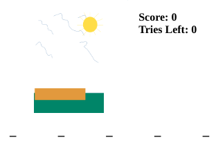

This is what it looks like when I solved the bug:

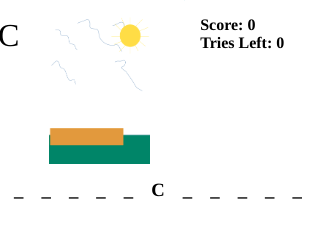

### [Hangman Images not Changing on Tries variable change](#table-of-content)

- What is it suppose to do?

Whenever I press an incorrect key and the variable for tries, changes the image is supposed to change with it.

- What is it doing?

The image is not changing with the variable it remains the same.

- How did I get it to work?

I created a variable in the hangman Images function which gets the innerHTML of the tries variable on the screen. This function will run every time the variable changes.
Replacing the existing content that was there.

What it looks like on a page load:

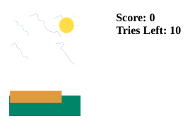

When tries variably changed, image did not change with it:

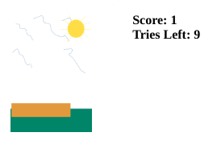

### [Image not displayed on negative tries variable](#table-of-content)

- What is it suppose to do?

It should show the final image when triesLeft variable hits below 0, in this case 0.png

- What is it doing?

It is showing no image when the triesLeft variable hits a negative number, giving an error in the console for image 
not found.

- How did I get it to work?

I created a ternary operator for the image variable,
Ternary operator logic goes like this: triesLeft > 0?
display the images as usual: display the last image in sequence

This is how it looks when you have used all of your tries?

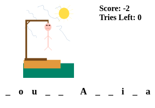

This is with the error when tries hits negative?

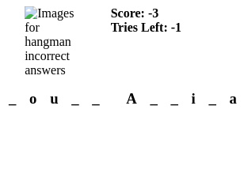

This is how it looks when I solved the bug?

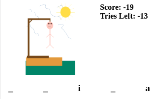

---

## [Credits](#table-of-content)

- Example of how i did the [timer](https://daily-dev-tips.com/posts/vanilla-javascript-timer/)
- Example of [keyboard](https://codepen.io/dcode-software/pen/KYYKxP?editors=0010)

- [Mentor](https://www.linkedin.com/in/lukebuchanan67/)
- [Code Institute](https://codeinstitute.net/)

---