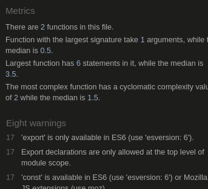

# Table of Content

Screenshots of all the files that were tested

- [script.js](#scriptjs)
- [components directory](#components-directory)
- [utils directory](#utils-directory)

---

## [Script.js](#table-of-content)

---

## [components directory](#table-of-content)

### [button](#table-of-content)

### [decrease-score](#table-of-content)

### [display-array](#table-of-content)

### [display-letter](#table-of-content)

### [hangman-image](#table-of-content)

### [increase-score](#table-of-content)

### [overlay](#table-of-content)

### [qwerty-keyboard](#table-of-content)

---

## [utils directory](#table-of-content)

### [overlay](#table-of-content)

#### [how-to-play](#table-of-content)

#### [loss](#table-of-content)

#### [win](#table-of-content)

### [check-letter-used](#table-of-content)

### [create-array](#table-of-content)

### [data](#table-of-content)

### [find-letter-in-array](#table-of-content)

### [line-break](#table-of-content)

### [random-value](#table-of-content)

### [sound](#table-of-content)

### [split-string-to-array](#table-of-content)

### [timer](#table-of-content)

